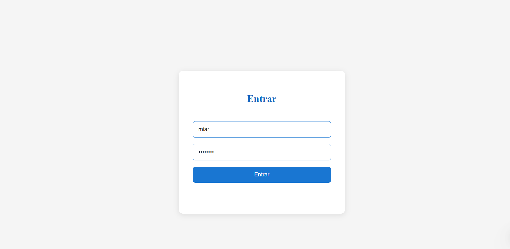
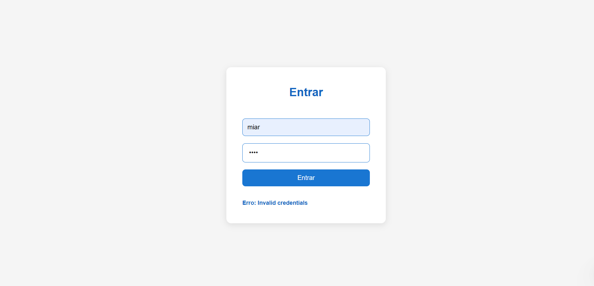
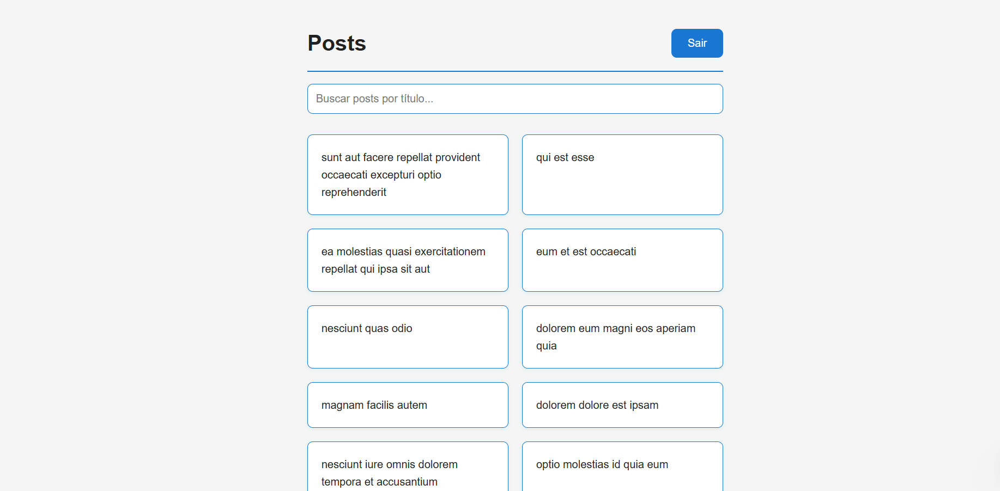
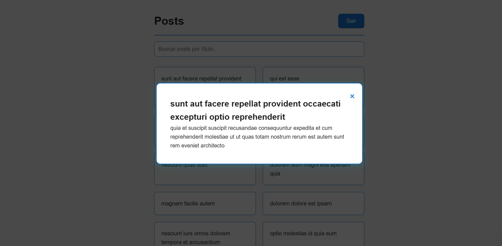
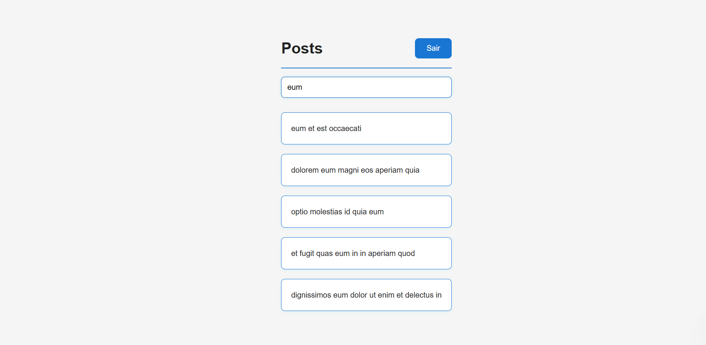
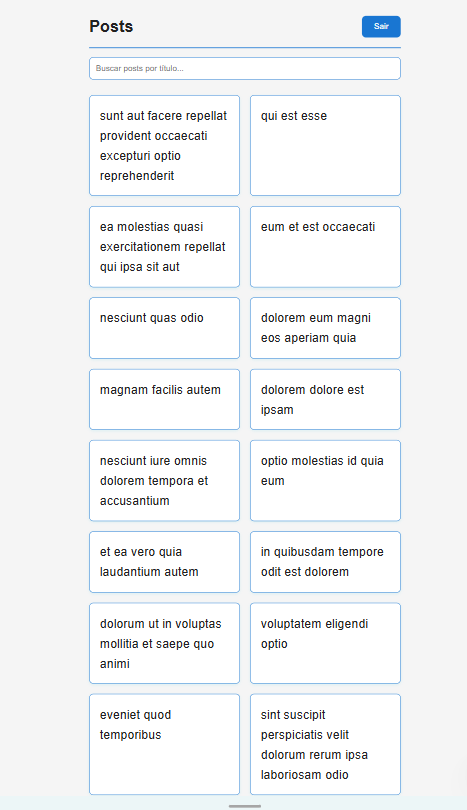

# Desafio Front-end - Nível Jr

## Objetivo

O objetivo deste desafio é avaliar suas habilidades em desenvolvimento de páginas web front-end. Você deverá criar uma UI simples que consome uma API pública, exibe os dados em uma lista, permite a navegação para uma tela de detalhes e possui uma funcionalidade de busca.

## Funcionalidades

### 1. Tela de Login



#### Usuário ou senha incorretos:



### 2. Tela de Listagem de Posts



### 3. Tela de Detalhes do Post



### 4. Funcionalidade de Busca



### 5. Responsividade UX



## Estrutura do Projeto

```
/index.html
/pages/
  /login.html
  /posts.html
/styles
  /main.css
/scripts
  /login.js
  /posts.js
```
